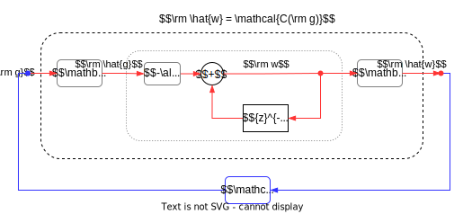

# AutoSGM
A PyTorch implementation of the automatic learning (or control) algorithm.



## What is this library about?
This library implements the *first-order gradient method*, for learning the parameters in a pre-defined (artificial) neural network (any appropriate composition of differntiable functions) that is used to fit a data-set. 

This method automatically arises as the empirical form of the best possible learning algorithm (*minimum bayes risk control function*) in the class of linear control functions. We call it **AutoSGM**.

Standing on the shoulders of about 7 decades of literature, we provide a clearer understanding of the three practical accelerated learning variants of the (Stochastic) Gradient Method (SGM), namely: *Polyak's Heavy ball*, *Nesterov Accelerated Gradient*, *Adaptive Moment Estimation* by presenting AutoSGM as their unifying representation for accelerated learning.


## Getting Started (installing or setting up)

- Download or Clone (cloning requires `git` on your machine).
```
git clone https://github.com/somefunagba/autosgm.git
```

- Installing necessary python libraries (if not on your machine).

This library uses PyTorch and Numpy, so they should be installed as Python libraries on your machine or virtual environment (if not already present).

## Folder Structure 
Next, the folders in the root directory are structured as shown below:

```
- root folder
  |-- arcs\
  |-- data\
  |-- expstore\
  |-- opts\
```
The ` opts ` folder contains the source-code for AutoSGM.

### Demo Scripts
There are included demo files that both help to demonstrate example neural network training with PyTorch, using AutoSGM.

```
|-- demo1show.ipynb
|-- demo2show.ipynb
|-- demo4show.ipynb
|-- demo5show.ipynb
```
In the root folder, locate and run ``demo1show.ipynb`` to check if your clone of this library is working right.

- `demo1show.ipynb`. 
Trains a custom fully connected network (Attention) on a toy dataset 

- `demo2show.ipynb`.
Trains a custom fully connected network (Attention) on FMNIST data

- `demo4show.ipynb`.
Trains a custom convolutional network (LeNet) on FMNIST data

- `demo5show.ipynb`.
Trains a custom convolutional network (ResNet-6) on FMNIST data 

The code in the ``demo[x]show.ipynb`` files, where `x` is an integer, mostly follows PyTorch's recipe and the outline is:

- Load Required Libraries
- Setup Configurations (Hyperparameters and so on)
- Load the Dataset
- Construct Model (Differentiable Function) with  necessary methods.
- Run the Network Modeling (Training)

The ` data ` folder stores raw data which form the basis for the whole learning setup.
The ` arcs ` folder is meant to store any custom neural network architecture.
The `expstore` folder stores training information, graphic plots and saved models, when each `demo[x]show.ipynb` file is run.

## API: Quick Use case (how tos?)

> Note: This work is an ongoing research and the function interface might slightly change in the future.

Load the library.
```
import opts.asgm.torchlasgm as asgm
...
```

Say, you have defined a neural network called `model`, then the quickest and minimal way to use this for training, is to call an instance of the loaded AutoSGM
and pass in the model parameters `model.parameters()` and the number of batches `num_batches` which is the data-size divided by batch-size.
```
optimizer = asgm.PID(model.parameters(),steps_per_epoch=num_batches)
```
Other than the two arguments above, there are other options in the function's interface, but they, most often, rarely need not be changed from their defaults.

The other options are documented in the AutoSGM source-code.


## Bugs, Issues or Questions (need help?)
Please, create a new issue or email me.

> Note also, that this doc. will also slightly change in the future.