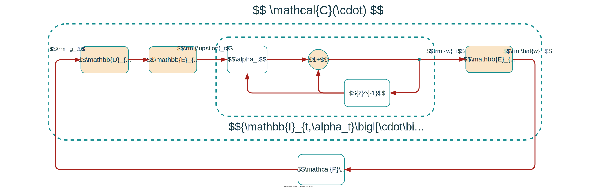

# AutoSGM : A Unified Lowpass Regularizing Framework for Accelerated Learning
Automatic (Stochastic) Gradient Method is a unifying framework for accelerated SGM implementations (Polyak's Heavy Ball (PHB), Nesterov's Accelerated Gradient (NAG), Adaptive Moment Estimation (Adam)). 

It explains observed acceleration in the SGM as the consequence of lowpass smoothing and approximating an optimal choice of step-size (which leads to normalized gradients). This digital structure leads to many implementations, as seen in the deep learning literature.

In this framework an artificial neural network (a well-defined differentiable function) is a gradient-generating function or system, and the SGM is a control function or system.

With this framework, there is only one (stochastic) gradient method (SGM), with different approaches or metrics to setting-up the step-size `alpha_t` parameter and smoothing the gradient by various lowpass filter implementations `E_t`,. The result is the different momentum-based SGD variants in the literature.

This repo. contains implementation(s) of AutoSGM: ```output = AutoSGM{input}```

Expected `input` is a first-order gradient. 
`output` is an estimate of each parameter in an (artificial) neural network. 

   

```
  input <- E_t{-g}
  state <- I_t{state,input,alpha_t} := state + alpha_t*input
  output <- E_t{state} // optional
```

This accelerated framework attempts to provide a clearer understanding of the three practical accelerated learning variants of the (Stochastic) Gradient Method (SGM), namely: *Polyak's Heavy ball*, *Nesterov Accelerated Gradient*, *Adaptive Moment Estimation*. 

+ an active smoothing (lowpass) component `E_t` regularizing the gradient generating system. 

+ a proportional component `alpha_t`.

+ a time-integration `I_t` component. 

+ optional averaging (lowpass) component `E_t `at its output.


### Basic signal-processing and control knowledge: 

+ the time-differencing, D_t, such as used in NAG is most always sensitive to input noise, so should usually be turned off.

+ the `E_t` at the output often can add unnecessary delay to the output estimates, so should usually be turned off or implemented cleverly to act as an ensemble averaging.

## Dependencies
PyTorch. Numpy. Peek in the [requirements.txt](requirements.txt) file.
<!-- 
Our code is entirely in Python, so we provide a [requirements.txt](requirements.txt) file through which using `pip` and optionally `virtualenv`, the python environment used by us can be reproduced. You may check 
[Installing packages using pip and virtual environments](https://packaging.python.org/en/latest/guides/installing-using-pip-and-virtual-environments/)
for best practices on this.

`pip install -r requirements.txt` -->

## Getting Started (installing)
Download or Clone with `git`.
```
>> git clone https://github.com/somefunagba/autosgm.git
```

<!-- ## Directory structure  -->

## PyTorch API:

**Calling an AutoSGM implementation**

Load an AutoSGM implementation. (This assumes this library, was directly git cloned to the root path of your project.)
```
...
import opts.autosgml as AutoSGM
...
```
****

Using PyTorch, say you have constructed a neural network called `mdl`, 
you can then: call an instance of the loaded AutoSGM, pass in the parameters of the model `mdl.parameters()`, and set other options.
```
optimizer = AutoSGM(mdl.parameters(), levels=3)
optimizer = AutoSGM(mdl.parameters(), lr_init=5e-4, spe=len(train_dataloader), restarts=True, movwin=30)
```
`levels` (int, optional): number of learning rates used. Defaults to `1`

`restarts` (bool, optional): use a raised cosine lowpass filter function to shape the gradient (default: False).

`spe` (int, optional): means steps per epoch and refers to the number of batches which is the data-size divided by batch-size. Defaults to `1` if not specified. Helps to detect, when the learning regime has enter a new epoch from a new iteration step. Inactive if `restarts` is `False`.

`movwin` indicates the initial window (in epochs) of a moving raised cosine lowpass filter. Defaults to `1`, restarting every epoch, if not specified. Inactive if `restarts` is `False`.

More possible options are documented in the [opts](opts/autosgml) directory. 
Many of the options, might likely need not be changed from the defaults.

For instance, to run Adam (an approximation of the optimal step-size), the code snippet below disables the iteration dependent learning rate for each parameter and uses a single initial constant learning rate value of `lr_init=5e-4` .
```
optimizer = AutoSGM(mdl.parameters(), lr_init=5e-4, autolr=False)

```
For instance, the code snippet below disables the optimal step-size approximation for each parameter and uses a single initial constant learning rate value of `lr_init=5e-4`.
```
optimizer = AutoSGM(mdl.parameters(), lr_init=5e-4, autolr=None)
```
<!-- self.sgm = AutoSGM(self.parameters(), 
                lr_init=cfgs["ss_init"], 
                spe=steps_per_epoch,epfreq=cfgs['epfreq'], 
                beta_d=cfgs['betad'], beta_o=cfgs['betao'],eps=cfgs['eps'],
                weight_decay=cfgs['weight_decay'], join_wdec=cfgs['joinwdecay'],
                auto_mode=cfgs["star_mode"],
                autolr=cfgs["auto_ss"], 
                foreach=cfgs['foreach'], fused=cfgs['fused'], lrlogstep=cfgs['lrlogstep'], down=cfgs['bayesdown']) -->

<!-- # Supplementary Material

This supplementary material contains the [Appendices](Appendices_asgm_nips.pdf) to support the submitted main-text in the AutoSGM paper and also reproduce the results shown in the paper. 

Here in this [README.md](README.md), we provide some instructions to run the [code](notebooks/)  -->


## Disclaimer
The code implementations and style in this repository is still undergoing active development as part of my PhD work. Feel free to raise an issue, if you detect any bug or you have any questions.


