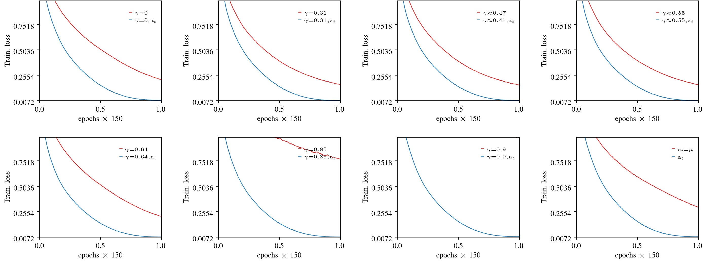

<p align="center">
    <h1 align="center">AutoSGM : A Unifying Framework for Accelerated Learning</h1>
    <p align="center"> What is Momentum? Is there a clearer way for us to reason about the popular stochastic gradient methods that dominate deep learning? </p>
    <p align="center">Enter the<a href="https://somefunagba.github.io/asgm" target="_blank">  <strong> AutoSGM </strong></a> framework .</p>

</p>

-  **Momentum** in (Polyak's Heavy Ball, **PHB** and Nesterov's Accelerated Gradient, **NAG**) are <a href="https://somefunagba.github.io/asgm_qsim" target="_blank"> **points in the design space**</a> of a **first-order lowpass filter**

- **Moment estimation** ( that is Adaptive Moment Estimation **Adam**) of the gradient's moment and **Partial-correlation estimators** are part of optimal iteration-dependent *learning rate* functions.

- Smoothing the gradient via the **first-order lowpass filter** is approximately smoothing the loss function, so its primary function is regularization not acceleration.

- In general, under a first-order filtering of the gradient, and choice of an iteration-dependent learning rate, the <a href="https://somefunagba.github.io/learning_dynamics" target="_blank">**stochastic gradient learning dynamics**</a> is that of a **first-order linear time (iteration) varying (LTV) filter** in the parameter-change level.

- Characterize **stability** properties of the stochastic gradient learning dynamics.

- Both **standard** weight-decay and **decoupled** weight-decay are **coupled damping** terms in the parameter-change level.

> [!NOTE]
> Parameter-change level is simply the path the stochastic gradient algorithm takes the actual parameter update through during learning.
<!-- Automatic (Stochastic) Gradient Method (SGM) is a <b>framework</b> for stochastic gradient learning that unifies the three popular momentum-based algorithms: (Polyak's Heavy Ball (<b>PHB</b>), Nesterov's Accelerated Gradient (<b>NAG</b>), Adaptive Moment Estimation (<b>Adam</b>)) used in deep learning. -->

<!-- Given a gradient-generating system like a deep neural network, the AutoSGM framework exposes the exact update trajectory of each trainable parameter via the stochastic gradient algorithm under a **lowpass filter** (momentum) and **iteration-dependent learning-rate** oracle as the dynamics of a **first-order linear time (iteration) varying (LTV) filter**. -->

<!-- This LTV description makes it possible to apply linear systems, control and signal‑processing tools to reason about stability, transient response, noise attenuation and steady-state convergence tradeoffs.  -->


   

> This AutoSGM implementation allows researchers and developers to play with several variations of the stochastic gradient algorithm, as they have been called, 
> such as Polyak’s Heavy Ball (PHB), Nesterov’s Accelerated Gradient (NAG), and Adam.

> By treating these methods as points in a design space of first-order filters and iteration-dependent learning rates, this framework makes it easier to explore how changes in smoothing, and learning rates affect training stability and performance.


## Example Instances — Playing with the Framework

> [!IMPORTANT]
> Common configurations are explained in [Setups](#setups).

```python
import math
from asgm import AutoSGM

# lr_cfg - setup learning-rate (lr) algorithm
# beta_cfg - setup filters: averaging, and grad smoothing
# rc_cfg - setup window (lr schedule)
# eps_cfg - setup numerical eps
# wd_cfg - setup weight decay

# training length
num_epochs = 1
iters_per_epoch = int(1E9)

# [gradient smoothing] lowpass filter's pole
beta = 0 # off


# Instance: Plain SGM, constant lr 1E-3, coupled weight-decay with wd constant 1E-4
opt0 = AutoSGM(
    model.parameters(),
    lr_cfg=(False, 1e-3, 0),  
    beta_cfg=(0.9999, 0.999, beta, 0.0, 0, True)
    wd_cfg=(1e-4, 0),   
    eps_cfg=(1e-8, ) 
)

# We decide to:

# 1. use moment estimation as part of the lr, 
# The rest of the configuration remains the same, except in lr_cfg.

# RMSProp
# Instance: Plain SGM, moment estimation, coupled weight-decay
opt1 = AutoSGM(
    model.parameters(),
    lr_cfg=(True, 1e-3, 0),  
    beta_cfg=(0.9999, 0.999, beta, 0.0, 0, True)
    rc_cfg=(1, 0, 0, 2, 1, num_epochs, iters_epoch, 1, 0),
    wd_cfg=(1e-4, 0),   
    eps_cfg=(1e-8, ) 
)


# 2. activate windowing, via cosine annealing as the lr schedule,
# The rest of the configuration remains the same, but we now need to setup rc_cfg.

# Instance: Plain SGM, moment estimation, standard cosine annealing, coupled weight-decay
opt2 = AutoSGM(
    model.parameters(),
    lr_cfg=(True, 1e-3, 0),  
    beta_cfg=(0.9999, 0.999, beta, 0.0, 0, True)
    rc_cfg=(1, 0, 0, 2, 1, num_epochs, iters_epoch, 1, 0),
    wd_cfg=(1e-4, 0),   
    eps_cfg=(1e-8, ) 
)

# 3. activate gradient smoothing, 
# The rest of the configuration remains the same, except in beta_cfg.
beta = 0.9 # activated with 0 < beta << 1

# 4. switch to decoupled weight-decay,
# The rest of the configuration remains the same, except in wd_cfg
# we now use a wd constant of 1E-2, and the 0 is replaced with 1

# Instance: PHB, moment estimation, standard cosine annealing, decoupled weight-decay
opt3 = AutoSGM(
    model.parameters(),
    lr_cfg=(True, 1e-3, 0),  
    beta_cfg=(0.9999, 0.999, beta, 0.0, 0, True)
    rc_cfg=(1, 0, 0, 2, 1, num_epochs, iters_epoch, 1, 0),
    wd_cfg=(1e-2, 1),   
    eps_cfg=(1e-8, ) 
)

# 5. use NAG: adjust the gradient smoothing filter's zero location from 0 to beta / (1 + beta)
# The rest of the configuration remains the same, except in beta_cfg.
gamma = beta/(1+beta) # gamma ~ 0.47 for beta = 0.9

# Instance: NAG, moment estimation, standard cosine annealing, decoupled weight-decay
opt4 = AutoSGM(
    model.parameters(),
    lr_cfg=(True, 1e-3, 0),  
    beta_cfg=(0.9999, 0.999, beta, gamma, 0, True),
    rc_cfg=(1, 0, 0, 2, 1, num_epochs, iters_epoch, 1, 0),
    wd_cfg=(1e-2, 1), 
    eps_cfg=(1e-8,)   
)

# 6. decide to use a different window as the lr schedule  
# The rest of the configuration remains the same, except in rc_cfg.

# Instance: NAG, Adam, linear decay, decoupled weight-decay
opt5 = AutoSGM(
    model.parameters(),
    lr_cfg=(True, 1e-3, 0),  
    beta_cfg=(0.9999, 0.999, beta, gamma, 0, True),
    rc_cfg=(2, 0, 0, 1, 1, num_epochs, iters_epoch, 1, 0),
    wd_cfg=(1e-2, 1), 
    eps_cfg=(1e-8,)   
)


# 7. use neither PHB nor NAG: adjust the filter's zero location <= beta 
# The rest of the configuration remains the same, except in beta_cfg.
gamma = 1 - math.sqrt(2*(1-beta)) # ~ 0.55

# 8. in the lr algorithm, in addition to moment estimation, 
# enable partial-correlation (parcor) estimation, 
# The rest of the configuration remains the same, except in lr_cfg.
optnum = 1 # or 2.
opt6 = AutoSGM(
    model.parameters(),
    lr_cfg=(True, 1e-3, optnum),  
    beta_cfg=(0.9999, 0.999, beta, gamma, 0, True),
    rc_cfg=(2, 0, 0, 1, 1, num_epochs, iters_epoch, 1, 0),
    wd_cfg=(1e-2, 1), 
    eps_cfg=(1e-8,)   
)

# change the lr numerator to a moment estimator, 
optnum = 3
# allows an higher learning rate than using only moment estimation,
# so instead of 1e-3, we may try something close but bigger like 1e-2
# The rest of the configuration remains the same, except in lr_cfg.
opt7 = AutoSGM(
    model.parameters(),
    lr_cfg=(True, 1e-2, optnum),  
    beta_cfg=(0.9999, 0.999, beta, gamma, 0, True),
    rc_cfg=(2, 0, 0, 1, 1, num_epochs, iters_epoch, 1, 0),
    wd_cfg=(1e-2, 1), 
    eps_cfg=(1e-8,)   
)


```

## Results [Paper]
Using Adam as a fixed learning-rate numerator (colored **red**) baseline for the fuller iteration-dependent learning rate (colored **blue**), we tested the AutoSGM framework on CIFAR-10 image-classifcation (ViT, ResNet) and language modeling (GPT-2 on WikiText-103 and Shakespeare-char) tasks.

Results: The **blue** curves mostly outperformed **red** curves, across several zero locations ($\gamma$) of the first-order lowpass filter.

### 1. GPT-2 on Shakespeare-char  


 

### 2. VIT on CIFAR10.  


    


### 3. ResNet18 on CIFAR10.  


     
 


### 4. GPT-2 on WikiText-103.  

 


<!-- ### Basic signal-processing and control knowledge:  -->

<!-- + crudely implementing the time-difference operation in *NAG* promotes noise and instability. -->


<!-- # Supplementary Material

This supplementary material contains the [Appendices](Appendices_asgm_nips.pdf) to support the submitted main-text in the AutoSGM paper and also reproduce the results shown in the paper. 

Here in this [README.md](README.md), we provide some instructions to run the [code](notebooks/)  -->


## Disclaimer
`Code` and `style` in this repository is under `active` development. Feel free to raise a `issue`, if you detect any `bug` or you have any questions.

## Minimal Example — Playing with the Framework
This section shows a minimal, easy-to-follow example of using the AutoSGM implementation with a PyTorch model and lists the most important configuration options.

```python
from asgm import AutoSGM
import torch

# example model
model = torch.nn.Sequential(
    torch.nn.Linear(10, 50),
    torch.nn.ReLU(),
    torch.nn.Linear(50, 1)
)

num_epochs = 1
iters_epoch = 100000

# Example: spawn an AutoSGM instance, with cosine annealing.
opt = AutoSGM(
    model.parameters(),
    lr_cfg=(True, 1e-2, 3),      # setup learning-rate (lr) algorithm
    beta_cfg=(0.9999, 0.999, 0.9, 0.5528, 0, True), # setup filters: averaging, and grad smoothing
    rc_cfg=(1, 0, 0, 2, 1, num_epochs, iters_epoch, 1, 0), # setup window (lr schedule)
    wd_cfg=(0.0, 0),             # setup weight decay
    eps_cfg=(1e-10,),            # setup numerical eps
)

# update parameters in training loop
opt.step()
opt.zero_grad()
```

## Setups
> Learning Rate (lr)
- `lr_cfg` = (`aoptlr`, `lr_init`, `num_lrc`)
  - `aoptlr`: *bool*. (**True** | **False**) 
    - **True**: use the iteration-dependent ratio function of a moment estimator, and a correlation estimator as the learning rate. 
    - **False**: use `lr_init` as a constant learning rate.
  - `lr_init`: *float*. trust-region constant used by the iteration-dependent ratio function when `aoptlr=True`
  - `num_lrc`: *int*. (0,1,2,3,4) select an estimator for the learning-rate numerator 
    - *0*: [robust] moment estimator + unity numerator (baseline). 
    - *1*: [robust] moment estimator + parcor estimator.
    - *2*: [robust] moment estimator + parcor estimator, with Huberized prefilter
    - *3*: [robust] moment estimator + moment estimator.
    - *4*: [robust] moment estimator + unity numerator, with Huberized prefilter.

> Filtering (gradient smoothing (lowpass regularization) and exponential moving averages (EMAs))
- `beta_cfg` = (`beta_n`, `beta_a`, `beta_i`, `gamma_i`, `eta_i`, `debias`)
  - `beta_n`: *float*. filter pole for EMA used in correlation estimation (expects long-term memory, that is a `beta_n` close to  `1`)
    - default is **0.9999**
  - `beta_a`: *float*. filter pole for EMA used in moment estimation (expects long-term memory, that is a `beta_a` close to `1`)
    - default is **0.999**
  - `beta_i`: *float*. smoothing filter's pole (`0 < beta_i < 1`).
    - default is **0.9**
  - `gamma_i`: *float*. smoothing filter's zero (less than the pole)
    - **HB**: set as `gamma_i=0` (default)
    - **NAG**: set as `gamma_i=beta_i/(1+beta_i)`
  - `eta_i`: *float*. input normalization constant for the smoothing filter
    - note the default `eta_i=0`, the code sets it to `eta_i=1-beta_i`.
  - `debias`: *bool*. (**True** | **False**) 
    - **True**, debias the filter output for improved transient-behavior (default).

> Weight-decay (L2 regularization)
- `wd_cfg` = (`wd_cte`, `wd_lvl`)
  - `wd_cte`: *float*. weight-decay constant.
  - `wd_lvl`: *int*. decoupling level (**0**, **1**) 
    - **0** weight decay coupled to gradient before smoothing.
    - **1** parameter-level decoupling of weight decay from gradient smoothing.

> Epsilon
- `eps_cfg` = (`eps`,)
  - `eps`: *float*. small positive constant used for numerical stability (avoid division by zero).

> Windowing (Learning-rate schedule)
- `rc_cfg` = (`rcm`, `inseq`, `x`, `n`, `m`, `tau`, `spe`, `cfact`, `e`)
  - `rcm`: *int*. window function (schedule type)
    - **0**: inactive, flat, 
    - **1**: raised-cosine
      -  `n >= 1`, standard cosine annealing (`n=2`, `m=1`), recommended, small `n`, `n < 4`
    - **2**: polynomial 
      - linear decay (`n=1`, `m=1`) or triangular if (`n=1`, `m=0`)
    - **3**: exponential (parameterized), 
    - **4**: simple-polynomial
      -  `n >=1`, recommended `1 < n < 20`
    - **5**: logistic-sigmoid, mid-inflection 
      - `n > 0`, recommended, small `n`, less than 10
    - **6**: logistic-sigmoid, late-inflection 
      - `n > 0`, recommended, small `n`, less than 10
  - `inseq`: *int*. input sequence type 
    - **0**: uniform/rectangular, 
    - **1**: kronecker/randomized ordering.
  - `x`: *float*. minimum fraction of unity (default is 0).
  - `n`: shaping parameter for the window function `rcm`
      - order. *int | float*  if `rcm` in {1, 2, 4, 5, 6}, 
      - decay rate. *float* if `rcm` in {3, }.
  - `m`: *int*. half window shape or full window envelope. 
    - **1**: half, means: flat-top -> anneal, 
    - **0**: full, means: warm-up ->  flat-top -> anneal.
  - `tau >= 1`: *int*. number of epochs (used in computing window length depending on `cfact`).
    - `tau=1` means one epoch. `tau` should be set as `1` if training is only in iterations.
  - `spe`: *int*. steps per epoch (iterations in one epoch).
    - For instance: `tau=1`, `spe=10000` means 10000 iterations in one epoch
  - `cfact`: *int*. (0,1,2,3,4). window's step unit 
    - **0**: step unit is per-epoch, 
    - **1**: step unit is per-iteration, 
    - **2**: step unit is per-iteration in each epoch (resets at each epoch).
  - `e`: *float*. flat-top coverage fraction of the window, `0 <= e < 1`.
    - Default is 0.
    - For instance: `e=0.5`, and `m=1` means first-half of the window is flat-top constant, and then in the other-half of the window annealing is observed.

## Questions or issues
If something doesn't behave as you expect, open an issue in the repository.


