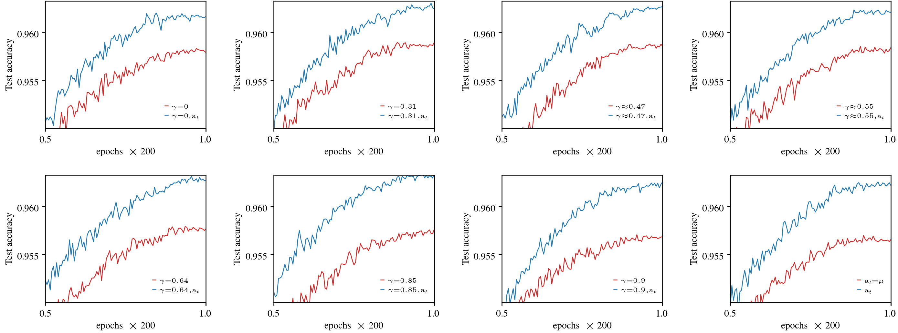

<p align="center">
    <h1 align="center">AutoSGM : A Unifying Framework for Accelerated Learning</h1>
    <p align="center"> What is Momentum? Is there a clearer way for us to reason about the popular stochastic gradient methods that dominate deep learning? </p>
    <p align="center">Enter the<a href="https://somefunagba.github.io/asgm" target="_blank">  <strong> AutoSGM </strong></a> framework .</p>

</p>

-  **Momentum** in (Polyak's Heavy Ball, **PHB** and Nesterov's Accelerated Gradient, **NAG**) are <a href="https://somefunagba.github.io/asgm_qsim" target="_blank"> **points in the design space**</a> of a **first-order lowpass filter**
- **Moment estimation** (or Adaptive Moment Estimation **Adam**) of the gradient is part of an optimal iteration-dependent *learning rate* function.

- The ratio-function of a **correlation estimator** and a **moment estimator** is an optimal iteration-dependent learning rate oracle.
- Smoothing the gradient via the **first-order lowpass filter** is approximately smoothing the loss function, so its primary function is regularization not acceleration.
- In general, under a first-order filtering of the gradient, and choice of an iteration-dependent learning rate, the <a href="https://somefunagba.github.io/learning_dynamics" target="_blank">**stochastic gradient learning dynamics**</a> is that of a **first-order linear time (iteration) varying (LTV) filter** at the parameter-change level.
- Characterize the **stability** of the stochastic gradient learning dynamics.
- Generalize the interpretation of **decoupled** weight-decay as **L2 regularization** at the parameter-change level.

<!-- Automatic (Stochastic) Gradient Method (SGM) is a <b>framework</b> for stochastic gradient learning that unifies the three popular momentum-based algorithms: (Polyak's Heavy Ball (<b>PHB</b>), Nesterov's Accelerated Gradient (<b>NAG</b>), Adaptive Moment Estimation (<b>Adam</b>)) used in deep learning. -->

<!-- Given a gradient-generating system like a deep neural network, the AutoSGM framework exposes the exact update trajectory of each trainable parameter via the stochastic gradient algorithm under a **lowpass filter** (momentum) and **iteration-dependent learning-rate** oracle as the dynamics of a **first-order linear time (iteration) varying (LTV) filter**. -->

<!-- This LTV description makes it possible to apply linear systems, control and signal‑processing tools to reason about stability, transient response, noise attenuation and steady-state convergence tradeoffs.  -->


   


## Examples
Using Adam as a fixed learning-rate numerator (colored **red**) baseline for the fuller iteration-dependent learning rate (colored **blue**), we tested the AutoSGM framework on CIFAR-10 image-classifcation (ViT, ResNet) and language modeling (GPT-2 on WikiText-103 and Shakespeare-char) tasks.

Results: The **blue** curves mostly outperformed **red** curves, across several zero locations ($\gamma$) of the first-order lowpass filter.

### 1. GPT-2 on Shakespeare-char  


 

### 2. VIT on CIFAR10.  


    


### 3. ResNet18 on CIFAR10.  


     
 


### 4. GPT-2 on WikiText-103.  

 


<!-- ### Basic signal-processing and control knowledge:  -->

<!-- + crudely implementing the time-difference operation in *NAG* promotes noise and instability. -->


<!-- # Supplementary Material

This supplementary material contains the [Appendices](Appendices_asgm_nips.pdf) to support the submitted main-text in the AutoSGM paper and also reproduce the results shown in the paper. 

Here in this [README.md](README.md), we provide some instructions to run the [code](notebooks/)  -->


## Disclaimer
The `code` and `style` in this repository is still undergoing `active` development as part of my `PhD` work. Feel free to raise an `issue`, if you detect any `bug` or you have any questions.

## Minimal example — Using AutoSGM
This section shows a minimal, easy-to-follow example of using the AutoSGM implementation with a PyTorch model and lists the most important configuration options.

```python
from asgm import AutoSGM
import torch

# example model
model = torch.nn.Sequential(
    torch.nn.Linear(10, 50),
    torch.nn.ReLU(),
    torch.nn.Linear(50, 1)
)

num_epochs = 1
iters_epoch = 100000

# Example: spawn an AutoSGM instance, with cosine annealing.
opt = AutoSGM(
    model.parameters(),
    lr_cfg=(True, 1e-3, 3),            # setup learning-rate (lr) algorithm
    beta_cfg=(0.9999, 0.999, 0.9, 0.5528, 0, True), # setup  averaging (lr), and lowpass filtering (grad.)
    rc_cfg=(1, 0, 0, 2, 1, num_epochs, iters_epoch, 1, 0), # setup window (lr schedule)
    wd_cfg=(0.0, 0),                  # setup weight decay
    eps_cfg=(1e-10, True),            # setup numerical eps
)

# update parameters in training loop
opt.step()
opt.zero_grad()
```

## Setups
#### 1. Learning Rate (lr)
- `lr_cfg` = (`aoptlr`, `lr_init`, `num_lrc`)
  - `aoptlr`: *bool*. (**True**, **False**) 
    - **True**: use an estimator iteration-dependent lr ratio (moment estimator, and optionally a correlation estimator). 
    - **False**: the learning rate constant `lr_init` is used as the learning rate.
  - `lr_init`: *float*. trust-region constant used by the iteration-dependent learning rate variants when `aoptlr=True`
  - `num_lrc`: *int*. (0,1,2,3,4) select the correlation estimator in the learning-rate ratio 
    - *0*, correlation estimator always 1, 
    - *1* correlation estimator < 1, via a chebyshev-style correlation estimator
    - *2* max-bound correlation estimator
    - *3* markov-style correlation estimator.
    - *4* chebyshev-style correlation estimator.

<!-- Notes on common config tuples
- beta_cfg = (beta_n, beta_a, beta_i, gamma_i, eta_i, debias)
  - beta_n, beta_a, beta_i: smoothing pole constants for internal EMAs and filters.
  - gamma_i: zero/predictive term for the smoothing filter (0 for HB, appropriate value for NAG-like behavior).
  - eta_i: input normalization for LPF (if 0, it's set automatically to 1-beta).
  - debias: bool. If True, debiased outputs are produced by the filters.

- rc_cfg = (rcm, inseq, x, n, m, tau, spe, cfact, e)
  - rcm: window mode (0=inactive, 1=raised-cosine, 2=tri/linear, 3=beta-exp, 4=simple-poly, 5=logistic, 6=other sigmoid).
  - inseq: input sequence type (0=uniform/rectangular, 1=kronecker/randomized ordering).
  - x: minimum fraction of function max (fmin = x * fmax).
  - n: shape parameter used by many window shapes (order, decay rate, etc.).
  - m: half/full mode (1=half/anneal-only, 0=full-window).
  - tau: number of epochs (or used in computing window length depending on cfact).
  - spe: steps per epoch (iterations per epoch).
  - cfact: step unit (0=epoch, 1=iteration, 2=sub-iteration).
  - e: coverage fraction (flat-top), 0 <= e < 1.

- wd_cfg = (wd_cte, wd_lvl)
  - wd_cte: weight-decay (L2) constant.
  - wd_lvl: decoupling level (0 uses classic parameter-level decay; 1 decouples weight decay from smoothing).

- eps_cfg = (eps, repeat_eps)
  - eps: small positive value added for numerical stability.
  - repeat_eps: bool controlling whether eps is applied once or twice in normalization.

Minimal tips
- Starting point: enable aoptlr=True to use an iteration-dependent learning-rate and try out three different variants of the learning rate algorithm (0,2,3).
- Enable rc_cfg windowing (rcm = 1); set tau and spe to match your number of training epochs and total training iterations per epoch; choose cfact according to whether you want the window to operate per-epoch or per-iteration.

Where to look next
- Inspect opts/asgm.py for details of the window functions (WINF, WINF_II) and the different numerator estimators (lrc_2, lrc_3) if you need to customize behavior.

Questions / issues
If something doesn't behave as you expect, open an issue in the repository with a minimal repro (model, optimizer config, and a few training steps). -->


